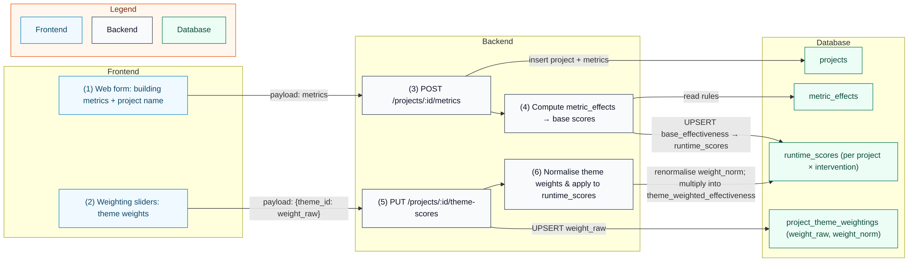
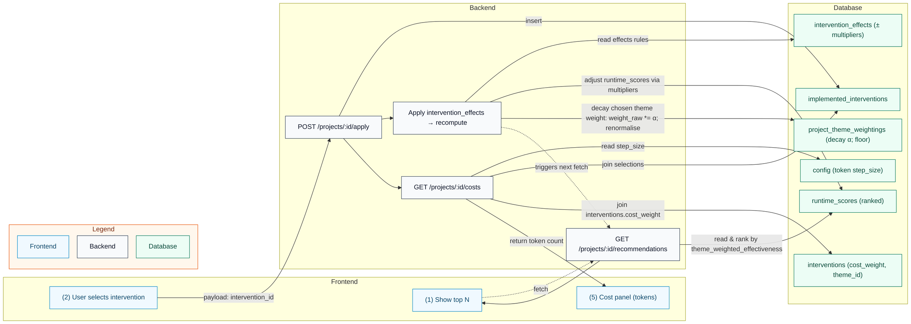
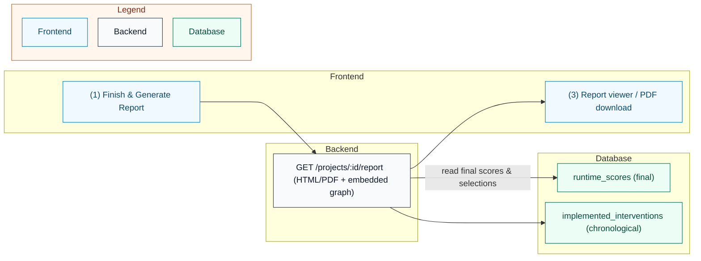

This page gives a high-level overview of the system, centring explanations on three diagrams:
1) Project setup and scoring from metrics/weights
2) Recommendation loop + cost tokens
3) Finish & report generation (with embedded graph)

---

## Background

| Term               | Meaning                                                                         |
| ------------------ | --------------------------------------------------------------------------      |
| **Project**        | Represents a building scenario including metrics and applied interventions      |
| **Metrics**        | Building attributes that influence sustainability scores                        |
| **Interventions**  | Strategies users can apply (e.g., Structural Optimisation, Low carbon concrete) |
| **Themes**         | Weighting priorities (e.g. energy, biodiversity)                                |
| **Runtime Scores** | Intermediate score calculations per project-intervention                        |

## 1) Project Setup & Scoring

Computes base scores from `metric_effects`, stores them in `runtime_scores`, then applies normalised theme weights from `project_theme_weightings` to produce `theme_weighted_effectiveness`.

## 2) Recommendation Loop + Cost Tokens

## 3) Finish & Report

