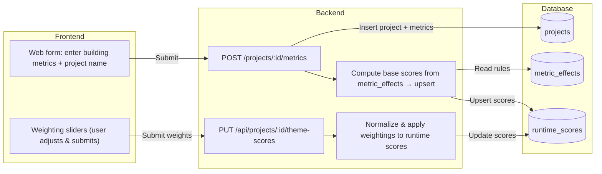
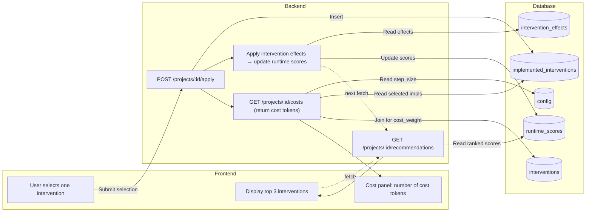
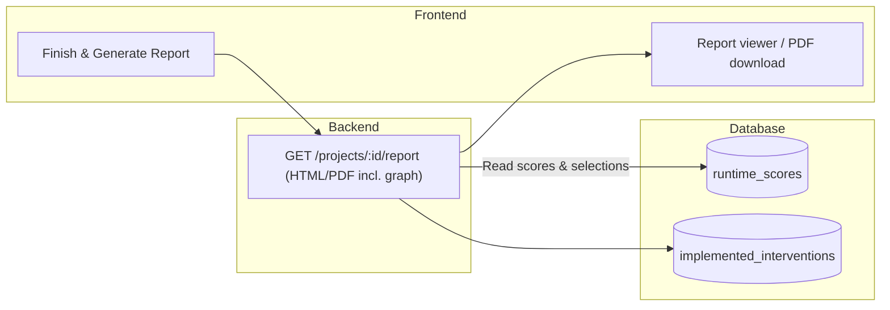

| Term               | Meaning                                                                    |
| ------------------ | -------------------------------------------------------------------------- |
| **Project**        | Represents a building scenario including metrics and applied interventions |
| **Metrics**        | Building attributes that influence sustainability scores                   |
| **Interventions**  | Strategies users can apply (e.g., green roof, insulation)                  |
| **Themes**         | Weighting priorities (e.g. energy, biodiversity)                           |
| **Runtime Scores** | Intermediate score calculations per project-intervention                   |

