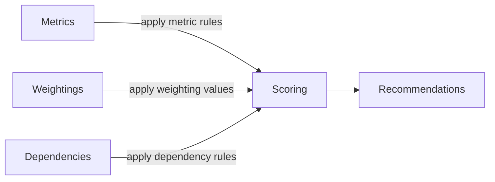

# System Design Philosophy

This document is written for future developers, maintainers, and stakeholders to understand the system's intent before engaging with technical/architectural details.

## Purpose
CarbonBalance is a tool to support sustainability decision-making in early-stage construction projects where data is uncertain and expert judgment still dominates. Instead of trying to provide exact answers, the system organises expert knowledge into a transparent heuristic model that can rank sustainability interventions, explore trade-offs, and communicate reasoning.

!!! tip
    CarbonBalance is not an AI system or a full-scale simulation model. It is a **structured decision-support system** that combines expert knowledge with simple, configurable heuristics.

### System Assumptions

1. Core data (interventions, themes, rules) is maintained by an administrative user with domain expertise.
2. Early-stage sustainability evaluation benefits more from **ranked guidance** than exact numerical predictions.
3. Each intervention can be assigned a baseline impact (**base effectiveness**) independent of specific project context.
4. Cost guidance is abstracted as **cost tokens**, representing feasibility rather than literal cost values.

### Design Principles
- Scoring should be deterministic, i.e. a given set of inputs should always produce the same output.
- **Interactivity** - the system makes suggestions, but the user is allowed to decide.
    - Maintaining some level of choice gives the user an impression of both control and responsibility
- **Extendability** - future rules and data should be easy to evolve (i.e., don't hardcode them, represent them in a modifiable form)

## Problem Context
Design decisions in construction start long before detailed engineering data exists. In the early stages of a project:

- Building form and materials are uncertain  
- Budgets are flexible  
- Sustainability goals are still being negotiated  

Attempting **data-driven precision** at this stage is misleading. Instead, **ranked heuristic guidance** is more valuable than exact predictions. Therefore, CarbonBalance uses a **transparent heuristic model** derived from expert knowledge rather than statistical modelling.

## Core Ideas
CarbonBalance implements a heuristic model intended to reflect Costplan's proprietary knowledge of sustainable construction interventions, a major challenge and goal in designing this system has been to create a simple means by which this knowledge can be translated to a combination of numeric values and logical rules in a general fashion.

I go into deeper detail discussion implementation in successive sections, but I'll begin by describing the key ideas driving this heuristic model.

### Pre-existing
These are concepts which have been directly taken from Costplan rather than invented to fit the heuristic system.

#### Interventions

An intervention is an action which can be taken to improve sustainability in a construction project. For example, "Enhanced Construction Monitoring" can reduce *embodied carbon* by ensuring material waste is low, while "Glazing Ratio Improvement" (i.e., choosing an appropriate window-to-wall ratio for the building and climate) reduces unwanted heat losses and solar gains while preserving useful daylight, which lowers HVAC and lighting energy use and thus *operational carbon*.

!!! note "Sustainability Themes" 
    *Operational carbon* and *embodied carbon* are examples of **themes**

#### Themes
Sustainability is multifaceted in that it is not a singular aim that interventions each contribute some flat amount of value to. Instead, sustainability can be broken up into themes which each may be more or less appropriate/achievable for a given construction project. These themes can be found in the 'Matrix' tab of the "P2035 - Sustainability Cost Matrix" document, and each intervention has been sorted into a theme in the "Detailed Matrix" tab, but you must first Unfreeze Panes (View -> Freeze Panes -> Unfreeze Panes) for them to be visible.

### Heuristic concepts
These are concepts which were created to facilitate the heuristic model developed to run CarbonBalance

#### Base effectiveness
The most basic assumption underpinning this model is that each intervention can be given a baseline effectiveness value which represents the inherent difference between interventions. Not all interventions are born equal, i.e. "Wayfinding Signage" will have a negligible impact on sustainability, while "Remove basement" will tend to have a fairly significant effect, as basement typically require a great deal of reinforced concrete, which has a high carbon footprint; removing this can greatly decrease $CO_2$. 

This "base effectiveness" value is used as the baseline for every project, and is scaled by:

1. Building metrics
    - External wall area
    - GIFA
    - Levels
    - ...
2. Theme weightings 
    - Users set weightings to represent how much they care about specific themes
3. Intervention dependencies
    - Complex dependencies often exist between interventions, e.g. if "Implementation of physical security measures" is implemented, "Security Risk Assessment" will have less overall impact, as there is a smaller capacity for improvement (i.e., overlapping interventions can be wasteful).

#### Building metrics
Building metrics are used to represent unique differences between projects. The values assigned to these metrics will be considered against heuristic rules in order to scale base effectiveness values in order to reflect the way in which differing project circumstances will effect how useful an intervention is. E.g., if a building has a small basement size as compared to its GIFA (gross internal flooring area), the "Remove basement" intervention will not be very effective. 

In order to represent this, we might have a metric scaling rule which states that if $GIFA:Basement Size < 0.25$, this will have a Strong Negative impact on the base effectiveness of "Remove basement", which we resolve to be $\times0.5$ multiplier.

<table>
  <tr>
    <th></th><th>Positive</th><th>Negative</th>
  </tr>
  <tr>
    <th>Strong</th><td>1.5</td><td>0.5</td>
  </tr>
  <tr>
    <th>Moderate</th><td>1.3</td><td>0.7</td>
  </tr>
  <tr>
    <th>Weak</th><td>1.1</td><td>0.9</td>
  </tr>
</table>

So if "Remove basement" has a base effectiveness of 8, but the building metric scaling rule has a Strong Negative impact on this score, $8 * 0.5 = 4$, so the score for "Remove basement" is adjusted to $4$ in the scope of the current project.

## User Experience
A simplified version of the ideal user experience can be modelled in the following way:

1. The user inputs their project metrics, or chooses a preset which is reasonably close to their project expectations
2. A selection of sliders for each theme is presented to the user. These can be set to represent how much the user cares about each theme
3. The $n$ best interventions are displayed to the user, they may pick one
4. After an intervention is selected, cost tokens are displayed representing, in an abstract way, the cost of the selected interventions.
5. The user will continue selecting an intervention from the pool in a loop. After each selection, scores are recalculated and a new set of interventions are recommended accordingly.
6. Once the user decides they have chosen enough interventions or the cost rating has grown too high, they may choose to end the recommendation process.
7. The list of implemented interventions and a graph displaying the relationships between selected interventions is displayed to the user.

## Scoring Model
As alluded to, the scoring model involves starting off by giving each intervention a score, then scaling these score in accordance with:
- Building metrics
- Theme weightings
- Dependencies between interventions

In our model, we consider the "best" intervention to be whichever has the highest score after all relevant scaling is applied.

You can read more about the scoring model [here](../architecture/scoring.md).
